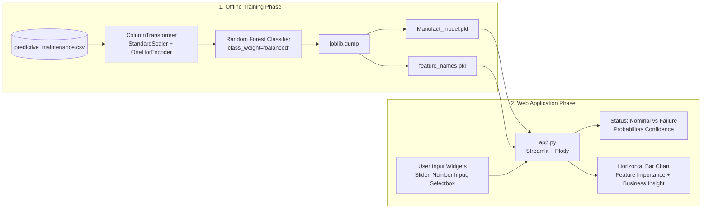

# Machine Health Monitor - Predictive Maintenance AI

> **Sistem deteksi dini risiko kerusakan mesin manufaktur (Predictive Maintenance) berbasis Machine Learning Pipeline dengan antarmuka interaktif Streamlit.**

Aplikasi ini mengklasifikasikan kondisi operasional mesin secara real-time menjadi status **Nominal (No Failure)** atau **Critical (Machine Failure)** beserta estimasi probabilitas risikonya, membantu tim teknis dan manajemen pabrik beralih dari perbaikan reaktif (run-to-failure) ke **preventive maintenance** terjadwal.

---

## Daftar Isi

- [Latar Belakang dan Masalah Bisnis](#latar-belakang-dan-masalah-bisnis)
- [Arsitektur dan Alur Sistem](#arsitektur-dan-alur-sistem)
- [Struktur Direktori](#struktur-direktori)
- [Dataset dan Fitur](#dataset-dan-fitur)
- [Pemodelan dan Pelatihan (train_model.py)](#pemodelan-dan-pelatihan-train_modelpy)
- [Aplikasi Web Streamlit (app.py)](#aplikasi-web-streamlit-apppy)
- [Feature Importance dan Analisis Perspektif Bisnis](#feature-importance-dan-analisis-perspektif-bisnis)
- [Panduan Menjalankan Secara Lokal](#panduan-menjalankan-secara-lokal)
- [Panduan Deployment ke Streamlit Community Cloud](#panduan-deployment-ke-streamlit-community-cloud)
- [Tech Stack](#tech-stack)

---

## Latar Belakang dan Masalah Bisnis

Kerusakan mesin yang tidak terduga (*unplanned downtime*) merupakan salah satu pemborosan biaya terbesar dalam industri manufaktur modern:
- **Biaya Langsung**: Penggantian komponen mesin yang rusak parah dan ongkos darurat teknisi ahli.
- **Biaya Tidak Langsung**: Terhentinya rantai produksi, keterlambatan pengiriman pesanan ke konsumen, hingga potensi bahaya keselamatan kerja (*workplace safety hazard*).

Melalui pendekatan **Predictive Maintenance**, sensor telemetri operasional mesin dianalisis menggunakan machine learning agar anomali beban dan keausan terdeteksi sebelum terjadi kegagalan fatal.

---

## Arsitektur dan Alur Sistem



1. **Standalone Training Pipeline**: Data mentah diproses dan dilatih secara mandiri melalui `train_model.py`. Model pipeline disimpan dalam artefak `.pkl`.
2. **Instant Inference**: `app.py` memuat model yang sudah jadi ke memori sekali saja menggunakan `@st.cache_resource` tanpa melakukan training ulang pada runtime.

---

## Struktur Direktori

```text
subtitle-generator/
|
|-- app.py                      # Aplikasi web Streamlit (Antarmuka inferensi dan dashboard)
|-- train_model.py              # Skrip pelatihan pipeline machine learning dan export .pkl
|-- predictive_maintenance.csv  # Dataset sensor operasional mesin manufaktur
|-- Manufact_model.pkl          # Model Pipeline tersimpan (Preprocessor + Random Forest)
|-- feature_names.pkl           # Daftar nama fitur input model
|-- requirements.txt            # Dependensi Python untuk lingkungan lokal dan Cloud
`-- README.md                   # Dokumentasi lengkap proyek
```

---

## Dataset dan Fitur

Dataset yang digunakan mencakup parameter telemetri mesin dengan 10.000 catatan operasional:

| Nama Kolom | Tipe Data | Deskripsi Operasional |
| :--- | :--- | :--- |
| `Type` | Kategorikal (`L`, `M`, `H`) | Kualitas produk/varian mesin (`Low` 50%, `Medium` 30%, `High` 20%) |
| `Air temperature [K]` | Numerik (Float) | Suhu udara lingkungan mesin (Kelvin) |
| `Process temperature [K]` | Numerik (Float) | Suhu proses internal mesin selama bekerja (Kelvin) |
| `Rotational speed [rpm]` | Numerik (Integer) | Kecepatan putaran poros mesin (*revolutions per minute*) |
| `Torque [Nm]` | Numerik (Float) | Torsi atau beban momen puntir yang dialami mesin (Newton-meter) |
| `Tool wear [min]` | Numerik (Integer) | Akumulasi waktu pemakaian mata pahat/alat pemotong (menit) |
| **`Target`** | Biner (`0`, `1`) | **Target Prediksi**: `0 = No Failure` (Normal), `1 = Failure` (Kerusakan) |

---

## Pemodelan dan Pelatihan (train_model.py)

Skrip pelatihan dirancang mengikuti standar rekayasa machine learning:

1. **Pembersihan Fitur**: Menghapus kolom identifikasi non-prediktif (`UDI`, `Product ID`, `Failure Type`).
2. **ColumnTransformer Preprocessing**:
   - `StandardScaler` untuk normalisasi seluruh fitur numerik.
   - `OneHotEncoder` untuk mengubah fitur kategorikal `Type` menjadi representasi vektor numerik.
3. **Penanganan Imbalanced Class**:
   - Karena kejadian mesin rusak jauh lebih sedikit dibanding mesin normal, parameter `class_weight='balanced'` diterapkan pada `RandomForestClassifier`.
4. **Metrik Evaluasi**:
   - Memastikan nilai **AUC-ROC >= 0.70** (memenuhi syarat kelayakan model klasifikasi).
5. **Serialisasi Model**:
   - Menyimpan seluruh alur transformasi dan klasifikasi ke dalam satu file terintegrasi `Manufact_model.pkl` dan daftar kolom ke `feature_names.pkl` menggunakan `joblib`.

Untuk melatih ulang model:
```bash
python train_model.py
```

---

## Aplikasi Web Streamlit (app.py)

Aplikasi web dibuat dengan antarmuka profesional bernuansa dark mode monokromatik (`Geist` dan `Geist Mono` typography):

- **Input Interaktif**:
  - `st.selectbox`: Memilih varian kualitas produk (`L`, `M`, `H`).
  - `st.slider`: Menentukan `Air temperature [K]`, `Process temperature [K]`, dan `Rotational speed [rpm]`.
  - `st.number_input`: Menentukan besaran `Torque [Nm]` dan `Tool wear [min]`.
- **Hasil Klasifikasi dan Probabilitas**:
  - Menampilkan badge status operasional: **`OPERATIONAL - NOMINAL`** atau **`FAILURE DETECTED`**.
  - Bar meter probabilitas terkalibrasi (`predict_proba`) untuk kelas *No Failure* vs *Failure*.
  - Kartu rekomendasi tindakan teknis sesuai tingkat risiko yang terdeteksi.
- **Data Summary**: Expander yang menyajikan rangkuman representasi data tabular yang dikirim ke model.

---

## Feature Importance dan Analisis Perspektif Bisnis

Di panel samping (*Sidebar*), aplikasi menyajikan visualisasi **Horizontal Bar Chart** dari nilai `feature_importances_` model Random Forest menggunakan Plotly.

### Analisis Bisnis (Business Insight)
> **Fitur Torque [Nm], Rotational speed [rpm], dan Tool wear [min] merupakan faktor paling dominan dalam menentukan potensi kegagalan mesin.**
>
> Dari perspektif bisnis manufaktur, hasil ini sangat rasional:
> 1. **Tool Wear (Keausan Pahat)**: Seiring berjalannya siklus pemotongan, material pahat mengalami degradasi mekanis yang melipatgandakan friksi dan panas pada benda kerja.
> 2. **Torque dan Rotational Speed**: Ketidakseimbangan antara kecepatan putar dan torsi mencerminkan gejala beban mekanik berlebih (*mechanical overload*) atau hambatan putaran akibat pelumasan yang aus.
>
> Dengan memantau ketiga variabel kritis ini secara proaktif, divisi operasional pabrik dapat menjadwalkan pergantian suku cadang tepat waktu sebelum kerusakan fatal terjadi, memangkas biaya perbaikan darurat hingga puluhan juta rupiah, serta mengoptimalkan *Overall Equipment Effectiveness* (OEE).

---

## Panduan Menjalankan Secara Lokal

### 1. Prasyarat
Pastikan sistem Anda telah terinstal **Python 3.9+** dan Git.

### 2. Kloning Repository dan Masuk Direktori
```bash
git clone https://github.com/<username>/<nama-repo>.git
cd <nama-repo>
```

### 3. Buat Virtual Environment (Opsional)
```bash
python -m venv venv
# Windows:
.\venv\Scripts\activate
# Linux/macOS:
source venv/bin/activate
```

### 4. Install Dependensi
```bash
pip install -r requirements.txt
```

### 5. Jalankan Aplikasi Streamlit
```bash
python -m streamlit run app.py
```
Akses antarmuka web melalui peramban di: `http://localhost:8501`.

---

## Panduan Deployment ke Streamlit Community Cloud

Aplikasi ini dirancang *zero-configuration* untuk langsung dapat di-deploy secara publik tanpa biaya:

1. **Push ke GitHub**: Pastikan repository Anda berstatus **Public** dan memuat berkas penting berikut:
   - `app.py`
   - `Manufact_model.pkl`
   - `feature_names.pkl`
   - `requirements.txt`
2. **Kunjungi Streamlit Community Cloud**: Buka [share.streamlit.io](https://share.streamlit.io/) dan masuk menggunakan akun GitHub Anda.
3. **Buat App Baru**:
   - Klik tombol **New app**.
   - Pilih repository GitHub dan branch (`main` atau `master`).
   - Isi **Main file path** dengan `app.py`.
4. **Deploy**: Klik tombol **Deploy!**. Dalam 1-2 menit, aplikasi Anda akan aktif dengan URL publik yang dapat diakses siapa saja tanpa perlu login.

---

## Tech Stack

- **Framework Web**: [Streamlit](https://streamlit.io/)
- **Visualisasi Interaktif**: [Plotly Express](https://plotly.com/python/) dan Matplotlib
- **Machine Learning**: [scikit-learn](https://scikit-learn.org/) (Pipeline, ColumnTransformer, RandomForestClassifier)
- **Manipulasi Data**: [Pandas](https://pandas.pydata.org/) dan [NumPy](https://numpy.org/)
- **Serialisasi Model**: [joblib](https://joblib.readthedocs.io/)
- **Tipografi UI**: Google Fonts (`Geist`, `Geist Mono`, `Inter`)
